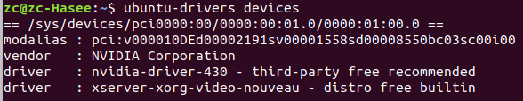
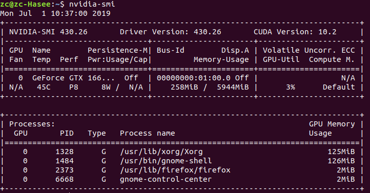
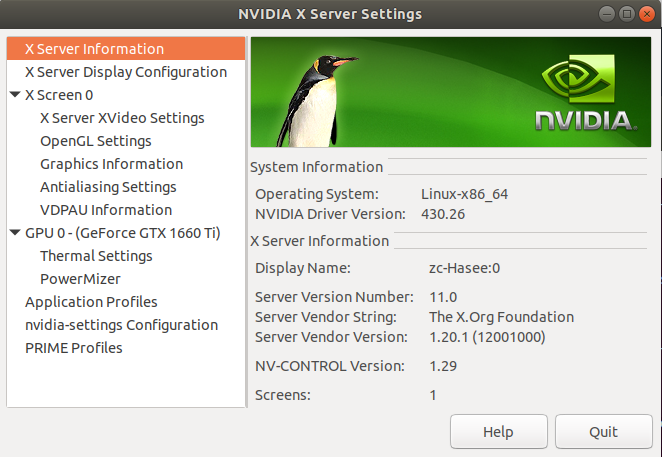
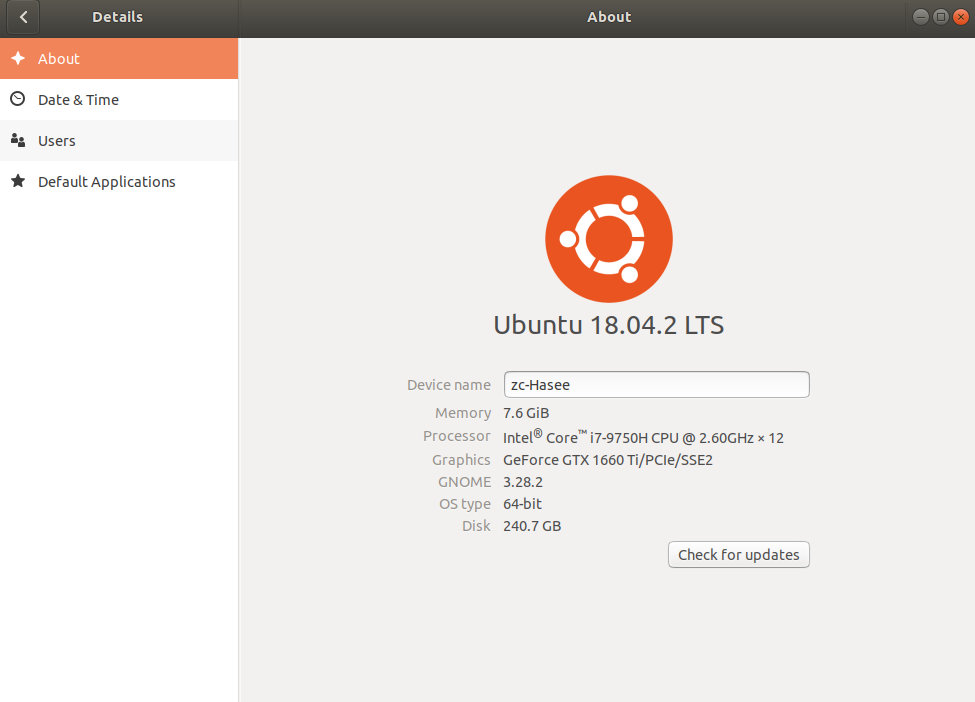
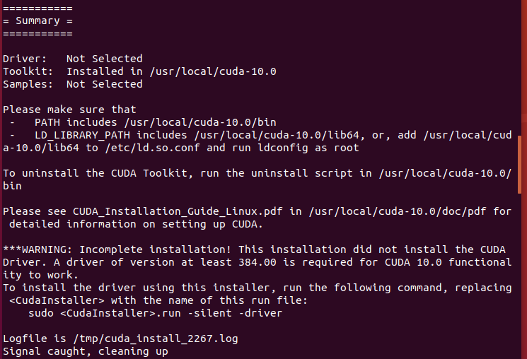
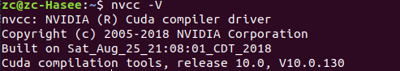
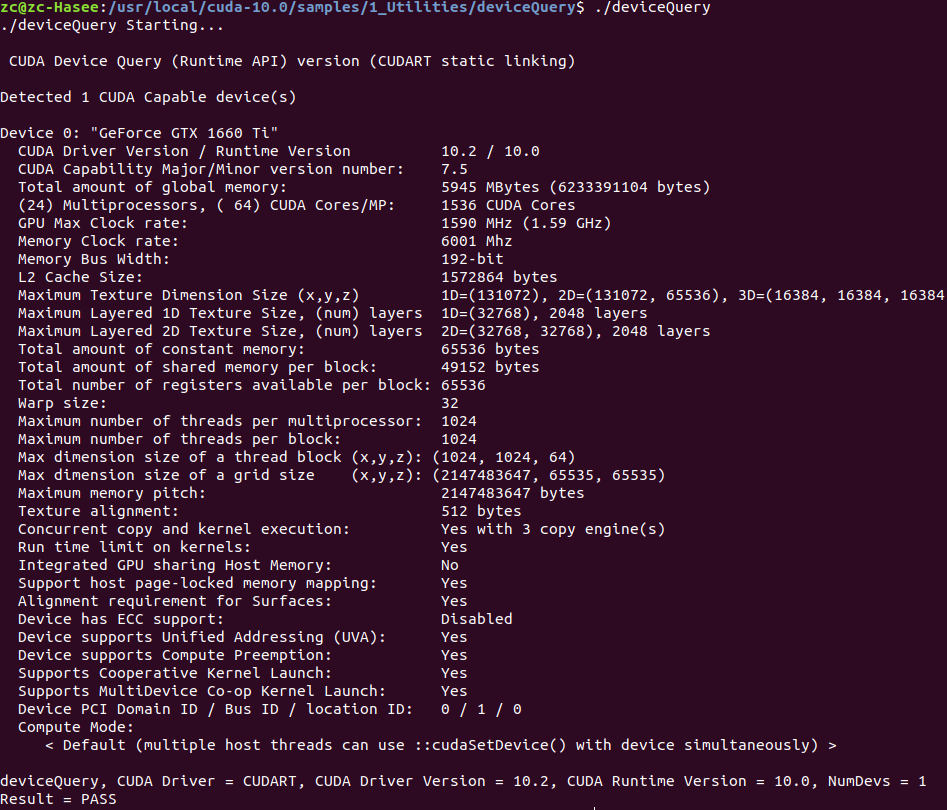

# Geforce GTX 1660Ti + Ubuntu18.04 LTS + Nvidia显卡驱动 +CUDA 10 配置安装  
<br>


## 一、安装环境介绍
操作系统：Ubuntu 18.04.2 LTS
系统内核：linux-image-4.18.0-25-generic
CPU：Intel Core i7-9750H
独立显卡：Geforce GTX 1660Ti 
<br>


## 二、安装Nvidia显卡驱动
```shell
sudo apt remove --purge nvidia*                      # 卸载已有的nvidia显卡驱动（如果已安装的话）
sudo add-apt-repository ppa:graphics-drivers/ppa     # 添加ppa源
sudo apt update                                      # 更新源列表
ubuntu-drivers devices                               # 查看可安装的驱动列表（见下图选择recommended那项进行安装）
sudo apt install nvidia-driver-430                   # 安装nvidia显卡驱动
sudo reboot                                          # 重新启动电脑
# 推荐三种方式检查自己nvidia显卡驱动是否安装成功
nvidia-smi                                           # 检查nvidia显卡的相关信息
nvidia-settings                                      # 查看nvidia设置面板
# 查看自己电脑的配置信息，有显示显卡型号，见下图截图
```




<br>


## 三、安装CUDA 10
下载CUDA 10安装文件：[下载地址](https://developer.nvidia.com/cuda-10.0-download-archive)。推荐使用runfile安装方式，有更丰富的自定义安装选项。


```shell
# 1 安装CUDA 10
sudo chmod +x cuda_10.0.130_410.48_linux.run     # 给安装文件赋予执行权限
sudo ./cuda_10.0.130_410.48_linux.run            # 运行执行文件

# 不想阅读冗长的EULA协议可Ctrl+C键跳过
Do you accept the previously read EULA?
accept/decline/quit: accept

# 问是否安装nvidia显卡驱动（cuda10自带），前面我们已经安装，此处不再安装，
# 如果选择yes，麻烦就大了，cuda10自带的显卡驱动会覆盖前面已经安装的显卡驱动，
# 而cuda10自带的显卡驱动版本号是410，然而1660Ti的显卡驱动最低要求版本为418，
# 如果安装了cuda10自带驱动，最终结果就是连系统桌面都打不开
Install NVIDIA Accelerated Graphics Driver for Linux-x86_64 410.48?
(y)es/(n)o/(q)uit:n

# 是否安装cuda工具包
Install the CUDA 10.0 Toolkit?
(y)es/(n)o/(q)uit:y

Enter Toolkit Location
[ default is /usr/local/cuda-10.0 ]: 按回车键

Do you want to install a symbolic link at /usr/local/cuda?
(y)es/(n)o/(q)uit: y 

# CUDA示例程序，是否安装看个人，我选择不安装
Install the CUDA 10.0 Samples?
(y)es/(n)o/(q)uit: n

# 安装完成后如下图所示，显示未完全安装，没有安装显卡驱动，这是我们选择安装显卡驱动时选择了no

# 2 配置CUDA 10环境变量
sudo gedit ~/.bashrc
# 在文件结尾添加以下两行
export LD_LIBRARY_PATH=/usr/local/cuda-10.0/lib64:$LD_LIBRARY_PATH
export PATH=/usr/local/cuda-10.0/bin:$PATH
# 刷新.bashrc文件
source ~/.bashrc

# 3 测试CUDA 10是否安装成功
# 查看CUDA 10版本号（如下图输出）
nvcc -V
# 测试样本案例（如下图输出 Result = PASS 表示安装成功）
cd /usr/local/cuda-10.0/samples/1_Utilities/deviceQuery
sudo make
./deviceQuery
```



<br>


## 参考文章
[1] [NVIDIA CUDA INSTALLATION GUIDE FORLINUX](https://developer.nvidia.com/cuda-10.0-download-archive)
[2] [ubuntu18.04 +Tensorflow1.12+cuda9.0+cudnn7.3+anaconda+GTX1660ti 深度学习环境配置](https://blog.csdn.net/qq_23996885/article/details/89881877)
[3] [win10 + ubuntu16.04双系统安装NVIDIA显卡驱动和cuda cudnn](https://blog.csdn.net/cdknight_happy/article/details/88566311)
[4] [CUDA9.1、cuDNN7在Ubuntu16.04上的安装](https://blog.csdn.net/jonms/article/details/79318566)
[5] [Ubuntu16.04安装NVIDIA驱动+CUDA9.0+cudnn7.0附详细步骤](https://www.machunjie.com/setup/86.html)
[6] [CUDA Compatibility](https://docs.nvidia.com/deploy/cuda-compatibility/#overview)
[7] [Manual Driver Search and Download](https://www.geforce.com/drivers)


